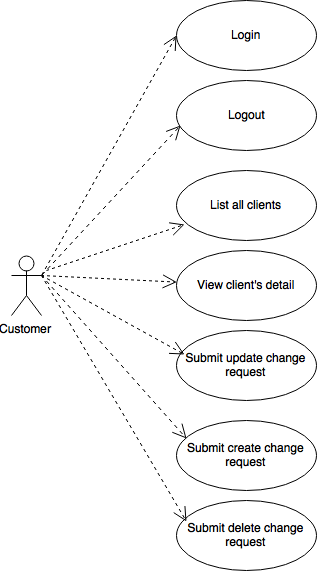
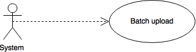

# Software Requirements Spectification for Request Change Collector

Version 2  
Prepared by Zdeněk Brabec  
brabezd1@fel.cvut.cz  
9.1.2017  

# Table of Contents
1. [Introduction](#introduction)
2. [Overall Description](#overall)
3. [External Interface Requirements](#external)
4. [System Features](#system)
5. [Other Nonfunctional Requirements](#nonfunctional)
6. [Other Requirements](#other)
7. [AppendixA: Analysis Model ](#analysis)

# Revision History

| Name          | Date          | Reason for changes  | Version |
| --------------|--------------:| --------------------|--------:|
| Zdeněk Brabec | 21.11.2016    | Intial specification| 1       |
| Zdeněk Brabec | 9.1.2017      | Fixed specification | 2       |

#1. Introdcution 

## Purpose
The Request Change Collector is a web application for submitting a change requests 
for database of clients.  

## Product Scope
The product offers the ability to create a change requests for existing database layer of clients. The goal is to achieve 
it in the user friendly package so it will be easy to submit change requests. 

#2. Overall Description 

## Product Perspective
The application is utilising API of a core application and will be a part of existing 
product portfolio. The product functionality depends on a functionality of the core 
application. The app will be using the API for listing all the clients, client’s 
detail and for submitting a new change request.

## Product Functions
Following diagrams sums up the customer’s and system's functions.

### Customer functions

### System functions

## User Classes and Characteristics

### Customer
The customer is basic and only one role which is distinguished by username and password. This user has permissions to 
do all actions briefly described in diagram above.  

### Anonymous User
Users without signing in are able to see login page only. 

### System
This is role for cron job doing a batch upload to the core application 

## Operating Environment
The application will be shipped as a source codes, including server scripts, static and other configuration files. 
The application will be horizontal scalable, prepared for deployment in a cluster.
  
## Design and Implementation Constraints
The application requires Mongodb 3.4.1 as main data storage. It is recommended to use Solid State Discs, at least 
3 replicas and 2 shards. Inbound traffic should be allowed from ports 80 and 443. Outbound traffic needs to be allowed
to the whole internet. The batch upload will be held as a cron job and will be delivered as isolated script. The customer
is responsible for setting up the cron schedule. Customer is also responsible for maintaining the delivered software.

Customer must deliver WDSL describing a core application before project start.

## User Documentation
User manual in markdown format describing all application features will be delivered.

## Assumptions and Dependencies
The application depends on core application API: the application won't crash without code app, but functionality will 
be reduced.

#3. External Interface Requirements 

## User Interfaces
There will be a navigation menu in header throughout the whole system containing Home, Create New Customer, 
Customers List and Login/Logout. The frontend will be written as a thin client in a template framework Handlebars.

### Login screen
Available for all kinds of users. It contains basic form for filling username and password.

### Main screen
Available for signed users.

### Customers list screen
Available for signed users. There is a list of all clients with reduced set of information(Id, First name, Surname and 
Status). Every table row contains a button for viewing a client detail.

### Customer detail screen
Available for signed users. The screen holds all the information about selected client:
- Id
- Status
- First name 
- Surname
- up to 3 addresses (Street name, Street number, Postal code, City part, City and Country)
- up to 3 phone numbers (Phone number Type, Phone number, City code, Country Code)
- Birth number
- Country of origin

This screen also allows to change attributes (all except Id and Status) and create change request. Also there will be an
option to create change request to delete detailed customer.

### Create new customer
This screen allows to submit change request for creating a new customer. It will be same as previous screen, but with
empty fields.

#4. System Features 

#5. Other Nonfunctional Requirements 

#6. Other Requirements 

#AppendixA: Analysis Model 